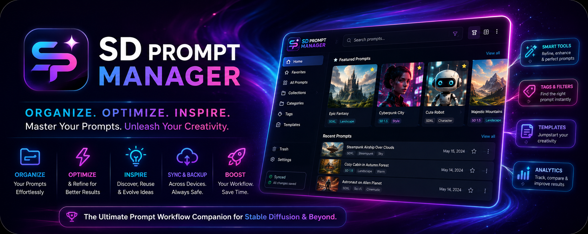

  

<h1 align="center">SD Prompt Manager Tool</h1>

  Build, manage and post Stable Diffusion prompts. 
  For artists working with character-driven, AI-generated imagery.

  <a href="https://github.com/valerie-4659/sd-prompt-manager-app/releases/latest"><b>⬇ Download</b></a> ·
  <a href="https://github.com/valerie-4659/sd-prompt-manager-app/wiki">Wiki</a> ·
  <a href="https://github.com/valerie-4659/sd-prompt-manager-app/issues">Report a problem</a> ·
  <a href="https://valerie-4659.itch.io/sd-prompt-manager">itch.io</a>

---

## What it does

Writing a good prompt is not the hard part. Writing the *same character* twenty times, across
different outfits, scenes and models, without her drifting — that is the hard part. This is a
desktop application for keeping that straight.

| | |
|---|---|
| 🧩 **Prompt Builder** | Multi-character assembly with live preview, freeze mode, weight controls and Danbooru autocomplete |
| 👤 **Character Library** | Reusable characters — anatomy, clothing, makeup, expressions, style presets. Define once, reuse everywhere |
| 🎲 **Procedural Builder** | Randomised generation with control over theme, mood, content level, pose and activity |
| 👗 **Clothing & Makeup** | Tag-based outfit builders with group weighting and saved presets |
| 🎨 **Style & Scene Presets** | Named collections for backgrounds, poses, clothing, makeup and accessories |
| ⚙️ **ComfyUI / Forge / A1111** | Direct integration: generate from the app and watch the progress |
| 🤖 **AI Optimizer** | Prompt refinement through OpenAI or Grok, with your own API key |
| 🔍 **Image Analysis** | Read a prompt back out of an image with OpenAI, Anthropic or Gemini |
| 🖼️ **Image Poster** | Manage generated images and post them to DeviantArt, X, Bluesky and others |

## Install

Download the file for your system from the
[latest release](https://github.com/valerie-4659/sd-prompt-manager-app/releases/latest).

| System | File |
|---|---|
| macOS | `.dmg` |
| Windows | `.exe` |
| Linux | `.AppImage` |

### The first launch will warn you

These builds are not code-signed, so the operating system does not recognise the publisher.

- **macOS** — right-click the app, choose **Open**, then confirm. Once is enough.
- **Windows** — SmartScreen shows a blue box. **More info** → **Run anyway**.

The warning is about a missing certificate, not about the file. If you would rather not take
that on trust, the [itch.io app](https://itch.io/app) installs and updates it for you.

## Requirements

The application runs on its own. To generate images from it you also need a local image
backend — **ComfyUI**, **Forge** or **A1111** — running on your machine or reachable on your
network. AI optimisation and image analysis are optional and use your own API key with the
provider you choose.

## Privacy

Your characters, presets and generated prompts live in a local database on your machine.
There is no account and no telemetry.

The application reaches the network when you ask it to: talking to your image backend,
sending a prompt to an AI provider with your own key, or posting an image. Nothing is
uploaded on its own.

## Something broken?

[Open an issue](https://github.com/valerie-4659/sd-prompt-manager-app/issues/new) and include
your platform, the version from the application, and what you did just before it went wrong.

The [Wiki](https://github.com/valerie-4659/sd-prompt-manager-app/wiki) covers installation,
first steps and troubleshooting.

## About this repository

This is where the releases, the wiki and the issue tracker live. The source is not public.

---

  Built by Valerie · <a href="https://valerie-4659.itch.io/sd-prompt-manager">itch.io</a>

